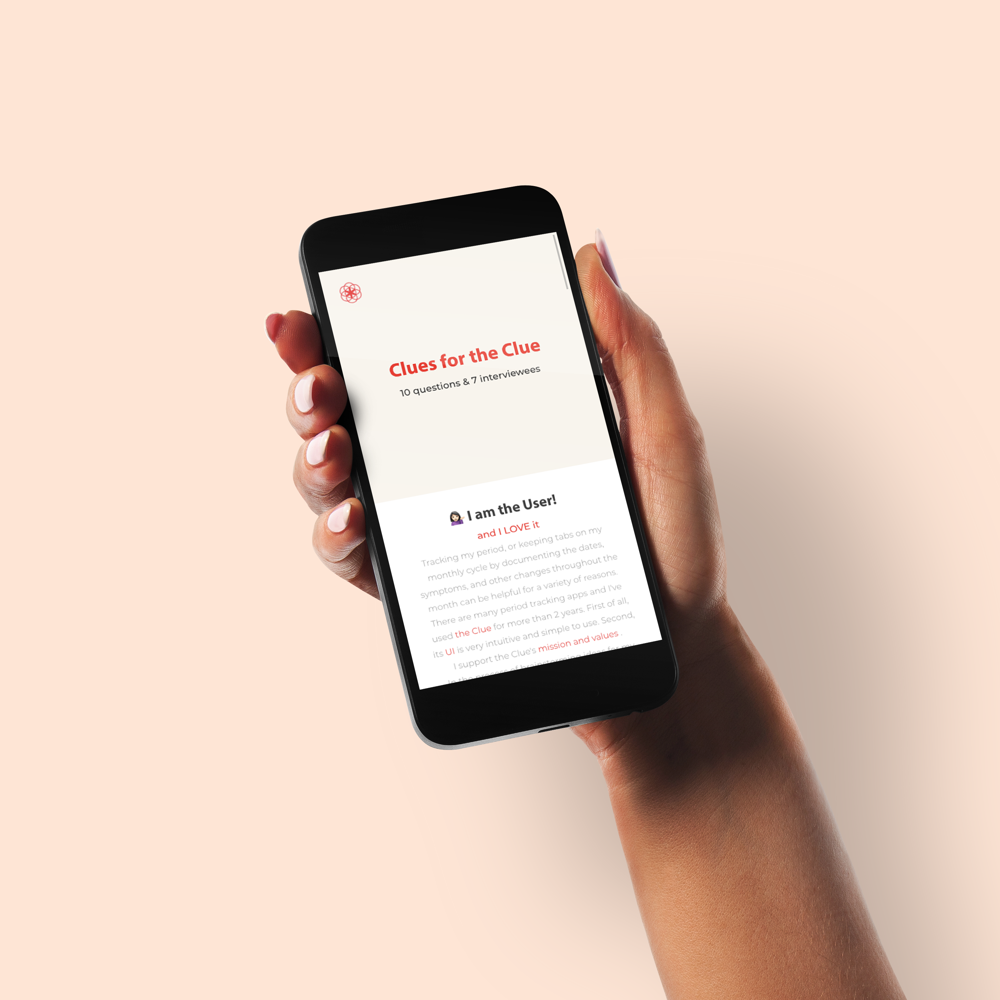
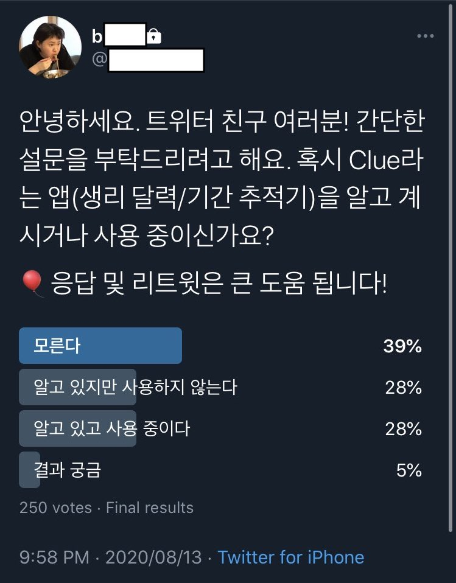

# [Clues for the Clue 🩸 (MOBILE OPTIMIZED)](https://clues-for-the-clue.netlify.app/) 

The purpose of this project is to conduct a survey about the app [Clue](https://helloclue.com/) and display the results on the browser using React JS.


<br/>
<br/>


## 🎨 Design Requirement

### The website should

- [x] be single page application
- [x] follow mobile-first approach
- [ ] have responsive design
- [x] have minimum clicks
- [x] display interview results with visual presentations
- [ ] have basic information of the Clue
- [x] have visual consistency with the Clue using the same color palette and the official logo
- [x] be deployed successfully


## 💁🏻‍♀️ Overview

### I am the user!

I've been bleeding for more than 15 years now. Monthly. Tracking my period, or keeping tabs on my monthly cycle by documenting the dates, symptoms, and other changes throughout the month can be helpful for a variety of reasons.

There are many period tracking apps and I've used the Clue for more than 2 years. First of all, its UI is very intuitive and simple to use. Second, I support the Clue's [mission and values](https://www.youtube.com/watch?v=z_k9_0eBoxg).

In the process of brainstorming ideas for my toy projects, I decided to take a look at an app that I use regularly and get the most health-related help from.

### I wanted to know

- general setting's of the users
- how satisfied the users are
- how many people are aware of the content Clue provides
- how many people are willing to pay for the Clue Plus(premium option)

## ✅ First Step: a Tiny Survey

I love Twitter. I have a anonymous account with 730 followers.

As far as I know, most of my fellow Twitter addicts are

- Korean 🇰🇷
- experiencing monthly menstruation 🩸

### I made a small poll on Twitter and here is the result!

<br/>

### Among 250 votes, 28% of them are the Clue users!

- 👥👤👥👤👥(39%): 'I don't know the app'
- 👤👥👤(28%): 'I know the app but don't use it'
- 👥👤👥(28%): 'I know the app and am using it' ♥️
- 👤(5%): 'I am just curious about the result'

## ✅ Secod Step: 10 Questions and Answers

As a following step, I did a small interview with 7 people who have been using Clue for several months or years.

### The interview consists of 10 questions about

- in-app setting
- general user experience
- contents of Clue
- Clue Plus

## ⚒️ Technologies

### This project is created with:

```
    "@testing-library/jest-dom": "^4.2.4",
    "@testing-library/react": "^9.5.0",
    "@testing-library/user-event": "^7.2.1",
    "d3-ease": "^2.0.0",
    "react": "^16.13.1",
    "react-circular-progressbar": "^2.0.3",
    "react-dom": "^16.13.1",
    "react-icons": "^3.11.0",
    "react-move": "^6.4.0",
    "react-scripts": "3.4.3",
    "styled-components": "^5.1.1"
```

## ☑️ Setup

to install dependencies

```
npm install
```

to run the application

```
npm start
```
